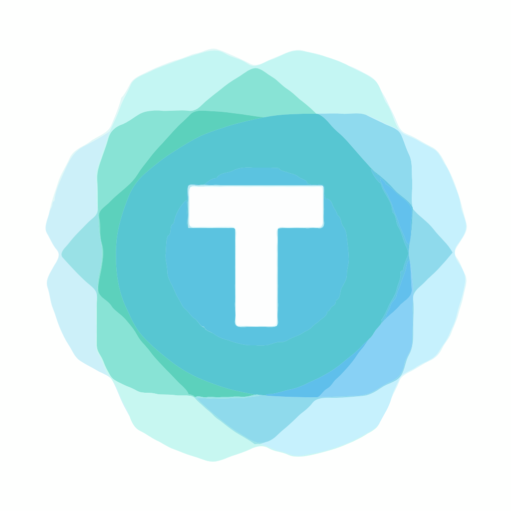

# Tide 🌊

<p align="center">
  
  <br>
  <em>A modern, declarative TUI framework for Go, inspired by Flutter</em>
</p>

<p align="center">
  <a href="https://github.com/watzon/tide/actions"></a>
  <a href="https://app.codecov.io/github/watzon/tide"></a>
  <a href="https://pkg.go.dev/github.com/watzon/tide"></a>
  <a href="https://goreportcard.com/report/github.com/watzon/tide"></a>
  <a href="https://opensource.org/licenses/MIT"></a>
</p>

Tide is a modern terminal UI framework for Go that makes building beautiful, responsive terminal applications as easy as building a Flutter app. With an intuitive, declarative API and powerful built-in widgets, you can create stunning TUIs in minutes.

## ✨ Features

- **Declarative UI**: Write UIs the same way you would in Flutter - no more manual screen management
- **Rich Widget Library**: Pre-built components for common UI patterns
- **Flexible Layouts**: Powerful layout system with Flex, Grid, and Stack widgets
- **Responsive Design**: Automatically adapts to terminal size changes
- **Beautiful Styling**: Rich text styling, borders, shadows, and color support
- **Event System**: Intuitive event handling with support for keyboard, mouse, and custom events
- **State Management**: Built-in state management inspired by Flutter's setState
- **Cross Platform**: Works on all major platforms and terminal emulators
- **Extensible**: Easy to create custom widgets and rendering backends

## 🚀 Getting Started

### Installation

```bash
go install github.com/watzon/tide/cmd/tide@latest
```

### Quick Start

> **Note**: The following examples show a future syntax that has not been implemented yet.

```go
package main

import (
    "github.com/watzon/tide"
    "github.com/watzon/tide/widget"
)

func main() {
    app := tide.NewApp(
        widget.NewColumn(
            widget.NewText("Welcome to Tide!").WithStyle(
                style.NewTextStyle().
                    WithForeground(color.Blue).
                    WithBold(true),
            ),
            widget.NewButton(
                "Click Me!",
                func() { println("Button clicked!") },
            ),
        ),
    )
    
    app.Run()
}
```

## 🎨 Example Gallery

<p align="center">
  
</p>

### Dashboard
```go
widget.NewContainer(
    widget.NewRow(
        widget.NewCard(
            widget.NewText("CPU Usage").WithSize(24),
            widget.NewProgressBar(0.75),
        ),
        widget.NewCard(
            widget.NewText("Memory").WithSize(24),
            widget.NewProgressBar(0.45),
        ),
    ),
)
```

### Form
```go
widget.NewForm(
    widget.NewTextInput().
        WithLabel("Username").
        WithPlaceholder("Enter username..."),
    widget.NewPasswordInput().
        WithLabel("Password"),
    widget.NewButton("Submit", handleSubmit).
        WithStyle(style.Primary),
)
```

## 📚 Documentation

Visit our comprehensive documentation at [tide.watzon.tech](https://tide.watzon.tech) to learn more about:

- [Getting Started Guide](https://tide.watzon.tech/docs/getting-started)
- [Core Concepts](https://tide.watzon.tech/docs/core-concepts)
- [Widget Catalog](https://tide.watzon.tech/docs/widgets)
- [Layout System](https://tide.watzon.tech/docs/layout)
- [State Management](https://tide.watzon.tech/docs/state)
- [Styling Guide](https://tide.watzon.tech/docs/styling)
- [Advanced Topics](https://tide.watzon.tech/docs/advanced)

## 🌟 Projects Using Tide

- [tidedash](https://github.com/example/tidedash) - A beautiful system monitoring dashboard
- [tideterm](https://github.com/example/tideterm) - Modern terminal multiplexer
- [tidenotes](https://github.com/example/tidenotes) - TUI note-taking app

## 🤝 Contributing

We love your input! Check out our [Contributing Guide](CONTRIBUTING.md) to get started.

## 📄 License

Tide is MIT licensed. See [LICENSE](LICENSE) for more details.

---

<p align="center">
  Made with ❤️ by <a href="https://github.com/watzon">Chris Watson</a>
  <br>
  Star ⭐ the project if you like it!
</p>